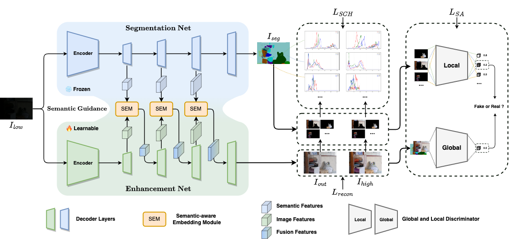

# [CVPR 2023] Learning Semantic-Aware Knowledge Guidance for Low-Light Image Enhancement [(Paper)](https://arxiv.org/abs/2304.07039)

Yuhui Wu, Chen Pan, Guoqing Wang*, Yang Yang, Jiwei Wei, Chongyi Li, Heng Tao Shen
(*Corresponding Author)

University of Electronic Science and Technology of China (UESTC)

## Introduction

This repository is the **official implementation** of the paper, "Learning Semantic-Aware Knowledge Guidance for Low-Light Image Enhancement", where more implementation details are presented.

## Motivation and Superiority


## Overall


## Dataset
You can refer to the following links to download the datasets:

LOL: Chen Wei, Wenjing Wang, Wenhan Yang, and Jiaying Liu. "Deep Retinex Decomposition for Low-Light Enhancement", BMVC, 2018. [[Baiduyun (extracted code: sdd0)]](https://pan.baidu.com/s/1spt0kYU3OqsQSND-be4UaA) [[Google Drive]](https://drive.google.com/file/d/18bs_mAREhLipaM2qvhxs7u7ff2VSHet2/view?usp=sharing) <br>
LOL-v2 (the extension work): Wenhan Yang, Haofeng Huang, Wenjing Wang, Shiqi Wang, and Jiaying Liu. "Sparse Gradient Regularized Deep Retinex Network for Robust Low-Light Image Enhancement", TIP, 2021. [[Baiduyun (extracted code: l9xm)]](https://pan.baidu.com/s/1U9ePTfeLlnEbr5dtI1tm5g) [[Google Drive]](https://drive.google.com/file/d/1dzuLCk9_gE2bFF222n3-7GVUlSVHpMYC/view?usp=sharing) <br> <br>

## Results
The evauluation results on LOL are as follows:

| Method | PSNR | SSIM | LPIPS | Method | PSNR | SSIM | LPIPS |
| :--: | :--: | :--: | :--: | :--: | :--: | :--: | :--: |
| RetinexNet         | 16.770 | 0.462 | 0.474 | HWMNet               | 24.240 | 0.852 | 0.114 |
| **RetinexNet-SKF** | **20.418** | **0.711** | **0.216** | **HWMNet-SKF**       | **25.086** | **0.860** | **0.108** |
| KinD               | 20.870 | 0.799 | 0.207 | SNR-LLIE-Net         | 24.608 | 0.840 | 0.151 |
| **KinD-SKF**       | **21.913** | **0.835** | **0.143** | **SNR-LLIE-Net-SKF** | **25.031** | **0.855** | **0.113** |
| DRBN               | 19.860 | 0.834 | 0.155 | LLFlow-S             | 24.060 | 0.860 | 0.136 |
| **DRBN-SKF**       | **22.837** | **0.841** | **0.138** | **LLFlow-S-SKF**     | **25.942** | **0.865** | **0.125** |
| KinD++             | 18.970 | 0.804 | 0.175 | LLFlow-L             | 24.999 | 0.870 | 0.117 |
| **KinD++-SKF**     | **20.363** | **0.805** | **0.201** | **LLFlow-L-SKF**     | **26.798** | **0.879** | **0.105** |
 

## Test and Train
More details can be found in the subfolder of each baseline.

## Citation
If you find our work useful for your research, please cite our paper
```
@inproceedings{wu2023skf,
  title={Learning Semantic-Aware Knowledge Guidance for Low-Light Image Enhancement},
  author={Yuhui, Wu and Chen, Pan and Guoqing, Wang and Yang, Yang and Jiwei, Wei and Chongyi, Li and Heng Tao Shen},
  booktitle={Proceedings of the IEEE/CVF Conference on Computer Vision and Pattern Recognition},
  pages={},
  year={2023}
}
```
## Contact
If you have any question, please feel free to contact us via wuyuhui132@gmail.com.
