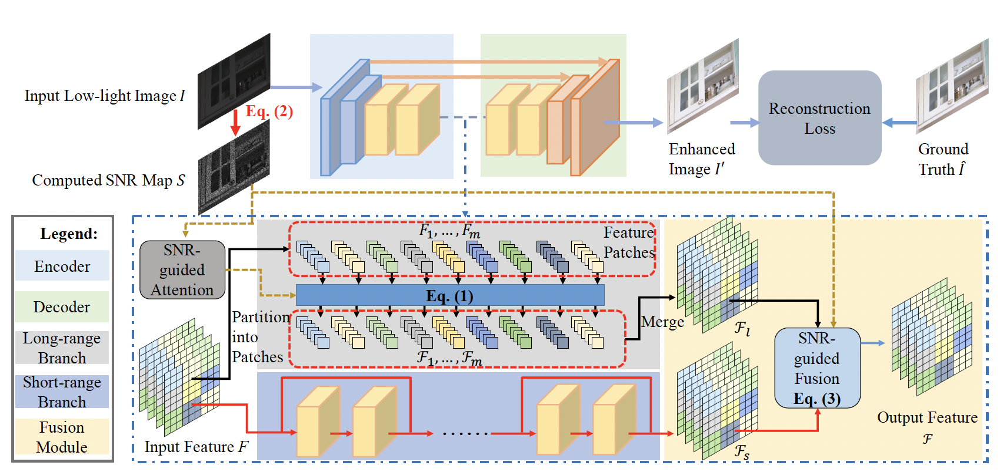

# SNR-aware Low-Light Image Enhancement

This is a pytorch project for the paper **SNR-aware Low-Light Image Enhancement** by Xiaogang Xu, Ruixing Wang, Chi-Wing Fu, and Jiaya Jia presented at **CVPR2022**.


## Introduction
This paper presents a new solution for low-light image enhancement by collectively exploiting Signal-to-Noise-Ratio-aware transformers and convolutional models to dynamically enhance pixels with spatial-varying operations.
They are long-range operations for image regions of extremely low Signal-to-Noise-Ratio (SNR) and short-range operations for other regions. 
We propose to take an SNR prior to guide the feature fusion and formulate the SNR-aware transformer with a new selfattention model to avoid tokens from noisy image regions of very low SNR.



[paper link](https://jiaya.me/publication/)

## dataset

### LOL datasets
Please download the LOL-v1 and LOL-v2 from [CVPR-2020-Semi-Low-Light](https://github.com/flyywh/CVPR-2020-Semi-Low-Light).

The directory of LOL-v1 should contain our485 and eval15.

The directory of LOL-v2-real should contain Real_captured/Train and Real_captured/Test.

The directory of LOL-v2-synthetic should contain Synthetic/Train and Synthetic/Test.

Please place the directory of LOL-v1, LOL-v2-real, and LOL-v2-synthetic under "datasets".

### SID and SMID dataset
For SID, we use the subset captured by the Sony camera and follow the script provided by SID to transfer the low-light images from RAW to RGB using rawpy’s default ISP. 

For SMID, we use its full images and also transfer the RAWdata to RGB, since our work explores low-light image enhancement in the RGB domain.

You can download our processed datasets for SID and SMID from [baidu pan](https://pan.baidu.com/s/1HRr-5LJO0V0CWqtoctQp9w) (验证码: gplv) and [baidu pan](https://pan.baidu.com/s/1Qol_4GsIjGDR8UT9IRZbBQ) (验证码: btux), and there should contain "SMID_Long_np and SMID_LQ_np" and "long_sid2 and short_sid2".

### SDSD dataset
Different from original SDSD datasets with dynamic scenes, we utilize its static version (the scenes are the same of original SDSD).

And you can download the SDSD-indoor and SDSD-outdoor from [baidu pan](https://pan.baidu.com/s/1rfRzshGNcL0MX5soRNuwTA) (验证码: jo1v) and [baidu pan](https://pan.baidu.com/s/1JzDQnFov-u6aBPPgjSzSxQ) (验证码: uibk), and there should contain "indoor_static_np" and "outdoor_static_np".

## Project Setup

First install Python 3. We advise you to install Python 3 and PyTorch with Anaconda:

```
conda create --name py36 python=3.6
source activate py36
```

Clone the repo and install the complementary requirements:
```
cd $HOME
git clone --recursive git@github.com:dvlab-research/SNR-Low-Light-Enhance.git
cd SNR-Low-Light-Enhance
pip install -r requirements.txt
```

## Usage

### Train
Train the model on the corresponding dataset using the train config.
For example, the training on indoor subset of SDSD:
```
python -m torch.distributed.launch --nproc_per_node 1 --master_port 4320 train3.py -opt options/train/SDSD_indoor.yml --launcher pytorch
```

### Test

We use PSNR and SSIM as the metrics for evaluation. Evaluate the model on the corresponding dataset using the test config.

For the evaluation on indoor subset of SDSD, you should write the location of checkpoint in ``pretrain_model_G" of options/test/SDSD_indoor.yml
use the following command line:
```
python test.py -opt options/test/SDSD_indoor.yml
```

For the evaluation on outdoor subset of SDSD, you should write the location of checkpoint in ``pretrain_model_G" of options/test/SDSD_outdoor.yml
use the following command line:
```
python test.py -opt options/test/SDSD_outdoor.yml
```

For the evaluation on SMID, you should write the location of checkpoint in ``pretrain_model_G" of options/test/SMID.yml
use the following command line:
```
python test.py -opt options/test/SMID.yml
```

For the evaluation on SID, you should write the location of checkpoint in ``pretrain_model_G" of options/test/SID.yml
use the following command line:
```
python test.py -opt options/test/SID.yml
```

For the evaluation on LOL-v1, you should write the location of checkpoint in ``pretrain_model_G" of options/test/LOLv1.yml
use the following command line:
```
python test_LOLv1_v2_real.py -opt options/test/LOLv1.yml
```

For the evaluation on LOL-v2-real, you should write the location of checkpoint in ``pretrain_model_G" of options/test/LOLv2_real.yml
use the following command line:
```
python test_LOLv1_v2_real.py -opt options/test/LOLv2_real.yml
```

For the evaluation on LOL-v2-synthetic, you should write the location of checkpoint in ``pretrain_model_G" of options/test/LOLv2_synthetic.yml
use the following command line:
```
python test_LOLv2_synthetic.py -opt options/test/LOLv2_synthetic.yml
```

### Pre-trained Model

You can download our trained model using the following links: https://drive.google.com/file/d/1g3NKmhz7WFLCm3t9qitqJqb_J7V4nzdb/view?usp=sharing

the model trained with indoor subset in SDSD: indoor_G.pth

the model trained with outdoor subset in SDSD: outdoor_G.pth

the model trained with SMID: smid_G.pth

the model trained with SID: sid_G.pth

the model trained with LOL-v1: LOLv1.pth

the model trained with LOL-v2-real: LOLv2_real.pth

the model trained with LOL-v2-synthetic: LOLv2_synthetic.pth

## Citation Information

If you find the project useful, please cite:

```
@inproceedings{wang2021sdsd,
  title={SNR-aware Low-Light Image Enhancement},
  author={Xiaogang Xu, Ruixing Wang, Chi-Wing Fu, and Jiaya Jia},
  booktitle={CVPR},
  year={2022}
}
```


## Acknowledgments
This source code is inspired by [EDVR](https://github.com/xinntao/EDVR), [attention-is-all-you-need-pytorch](https://github.com/jadore801120/attention-is-all-you-need-pytorch).

## Contributions
If you have any questions/comments/bug reports, feel free to e-mail the author Xiaogang Xu ([xgxu@cse.cuhk.edu.hk](xgxu@cse.cuhk.edu.hk)).
